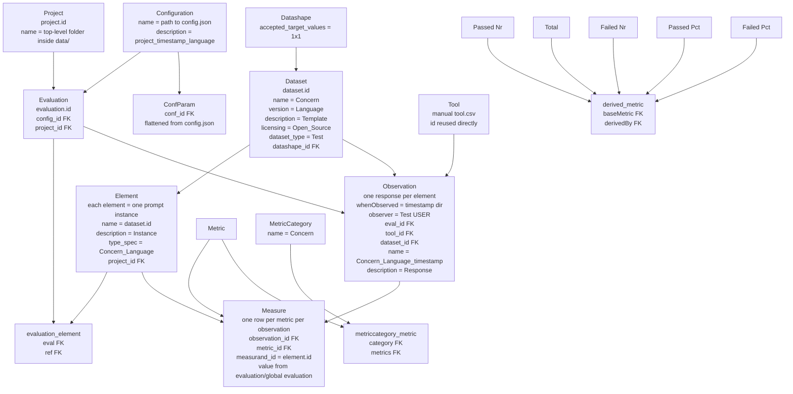

# MLABiTe refactored mapping guide

This guide shows how the accumulated CSVs should map into the refactored schema.

## 1) High-level entity flow



## 2) Box view of the main chain

```text
+------------------+
| project          |
| id               |
| name             |  <- each directory under data/ except data_accumulated
| status           |
+------------------+
          |
          | project_id
          v
+------------------+        +------------------+
| evaluation       |<-------| configuration    |
| id               |        | id               |
| status           |        | name             | <- config.json path
| config_id        |        | description      |
| project_id       |        +------------------+
+------------------+                 |
          |                           | conf_id
          |                           v
          |                  +------------------+
          |                  | confparam        |
          |                  | id               |
          |                  | name             |
          |                  | value            |
          |                  | param_type       |
          |                  | conf_id          |
          |                  +------------------+
          |
          v
+------------------+        +------------------+
| dataset          |<-------| datashape        |
| id               |        | id               |
| name             |        | accepted_target  |
| description      |        +------------------+
| source           |
| version          |
| licensing        |
| dataset_type     |
| datashape_id     |
+------------------+
          |
          | dataset.id stored as element.name
          v
+------------------+
| element          |
| id               |
| name             | <- dataset.id
| description      | <- one prompt instance
| project_id       |
| type_spec        | <- Concern_Language
+------------------+
          |
          | eval/ref link
          v
+------------------+
| evaluation_element |
| eval             |
| ref              |
+------------------+
          |
          | one response per element
          v
+------------------+
| observation      |
| id               |
| name             |
| description      | <- response text
| observer         |
| whenObserved     |
| eval_id          |
| tool_id          |
| dataset_id       |
+------------------+
          |
          | one measure row for each metric
          v
+------------------+
| measure          |
| id               |
| value            |
| error            |
| uncertainty      |
| unit             |
| observation_id   |
| metric_id        |
| measurand_id     | <- element.id
+------------------+
```

## 3) Detailed mapping rules

### Project
- **Source**: each directory directly inside `data/`, excluding `data_accumulated`
- **project.id**: deterministic hash of project name
- **project.name**: project directory name
- **project.status**: `Ready`

### Evaluation
- One evaluation is created per **project + timestamp_dir + language**
- **evaluation.config_id** -> `configuration.id`
- **evaluation.project_id** -> `project.id`
- **evaluation.status**: `Done`

### Dataset
One dataset is created per **project + concern + language + template**.

- **dataset.name** = `Concern` from `*_evaluations.csv`
- **dataset.version** = `Language` from `*_evaluations.csv`
- **dataset.description** = `Template` from `*_evaluations.csv`
- **dataset.licensing** = `Open_Source`
- **dataset.dataset_type** = `Test`
- **dataset.datashape_id** -> `datashape.id`
- **dataset.source** = `ERROR` for now, because this field was not specified in the new mapping

### Datashape
- One shared row is enough
- **datashape.accepted_target_values** = `1x1`

### Element
One element is created for each **instance of a template prompt**.

- **element.name** = corresponding `dataset.id`
- **element.description** = matching `Instance` from `*_responses.csv`
- **element.project_id** -> `project.id`
- **element.type_spec** = `Concern_Language`

### How template → instance matching works
Two steps are used together:

1. **Estimate expected number of instances** from `config.json`
   - looks for concern/language related community mappings
   - placeholder-based templates such as `{AGE}`, `{GENDER1}`, `{GENDER2}` are used to estimate repetition count

2. **Regex / rendered-template matching** against `*_responses.csv`
   - template placeholders are converted to wildcards
   - if `config.json` provides concrete substitutions, the script also renders the template and tries exact matching
   - if matching is weak, it falls back to ordered assignment

### Observation
One observation is created for each **element / prompt instance**.

- **observation.whenObserved** = timestamp from the results directory
- **observation.observer** = `Test USER`
- **observation.eval_id** -> `evaluation.id`
- **observation.tool_id** -> `tool.id` from manual `tool.csv`
- **observation.dataset_id** -> `dataset.id`
- **observation.name** = `Concern_Language_timestamp`
- **observation.description** = matching `Response` from `*_responses.csv`

### Measure
Each observation gets one measure per metric.

- Row-level metrics come from `*_evaluations.csv`
- Global metrics come from `*_global_evaluation.csv`
- Global values are **replicated** for every observation linked to the same dataset/template group
- **measure.value** = metric value from the relevant CSV
- **measure.error** = `Not available for MLABiTe`
- **measure.uncertainty** = `0.0` because the DB column is numeric
- **measure.unit** depends on metric name
- **measure.observation_id** -> `observation.id`
- **measure.metric_id** -> `metric.id`
- **measure.measurand_id** -> `element.id`

## 4) Metric mapping

### metric
| metric.name | metric.type_spec |
|---|---|
| Oracle Evaluation | Direct |
| Oracle Prediction | Direct |
| Evaluation | Direct |
| Passed Nr | Direct |
| Failed Nr | Direct |
| Error Nr | Direct |
| Passed Pct | Derived |
| Failed Pct | Derived |
| Total | Direct |
| Tolerance | Direct |
| Tolerance Evaluation | Derived |

### direct
- Oracle Evaluation
- Oracle Prediction
- Evaluation
- Passed Nr
- Failed Nr
- Error Nr
- Total
- Tolerance

### derived
- Tolerance Evaluation
- Passed Pct
- Failed Pct

### derived_metric FK rules
| baseMetric | derivedBy |
|---|---|
| Passed Nr | Passed Pct |
| Total | Passed Pct |
| Failed Nr | Failed Pct |
| Total | Failed Pct |

## 5) MetricCategory mapping

- **metriccategory.name** = `Concern`
- **metriccategory.description** = generated placeholder text
- `metriccategory_metric` links each concern category to **all metrics**, so queries remain fully connected

## 6) Configuration mapping

### configuration
- **configuration.name** = full path to `config.json`
- **configuration.description** = `project.name + '_' + observation.whenObserved + '_' + dataset.version`

### confparam
`config.json` is flattened recursively.

Examples of names that can appear:
- `nRetries`
- `temperature`
- `tokens`
- `config_filename`
- `prompts_filename`
- `useLLMEval`
- `requirements[0].name`
- `requirements[0].rationale`
- `requirements[0].languages`
- `requirements[0].tolerance`
- `requirements[0].delta`
- `requirements[0].concern`

## 7) FK checklist

### Main FK links
- `evaluation.config_id` -> `configuration.id`
- `evaluation.project_id` -> `project.id`
- `dataset.datashape_id` -> `datashape.id`
- `element.project_id` -> `project.id`
- `observation.eval_id` -> `evaluation.id`
- `observation.tool_id` -> `tool.id`
- `observation.dataset_id` -> `dataset.id`
- `measure.observation_id` -> `observation.id`
- `measure.metric_id` -> `metric.id`
- `measure.measurand_id` -> `element.id`
- `confparam.conf_id` -> `configuration.id`

### Link tables
- `evaluation_element.eval` -> `evaluation.id`
- `evaluation_element.ref` -> `element.id`
- `metriccategory_metric.category` -> `metriccategory.id`
- `metriccategory_metric.metrics` -> `metric.id`
- `derived_metric.baseMetric` -> `metric.id`
- `derived_metric.derivedBy` -> `derived.id` / `metric.id` shared identifier

## 8) Notes / assumptions

- `tool.csv` is **manual input** and should already exist in `data/data_accumulated/tool.csv`
- `dataset.source` is currently set to `ERROR` because the new mapping did not define a value for it
- The script uses `ERROR` for missing string fields
- For numeric fields like `measure.uncertainty`, the script uses `0.0` because the DB column is numeric and cannot safely store the string `ERROR`
